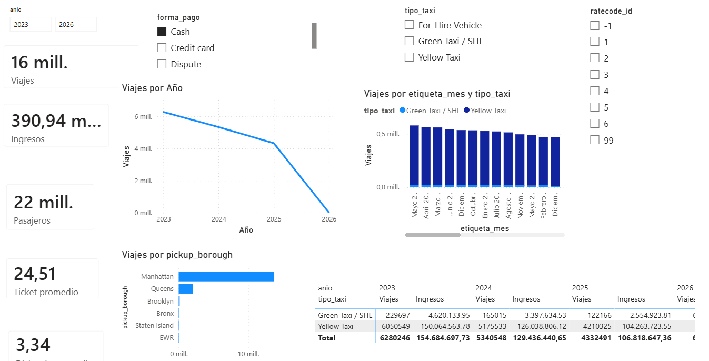

# Pipeline de Datos Masivos: NYC TLC Trip Record (PySpark)

Proyecto de Ingeniería de Datos que implementa un pipeline reproducible para la ingesta, control, limpieza y auditoría de los registros de viajes de la New York City Taxi and Limousine Commission (NYC TLC). El proyecto fue desarrollado académicamente en la Universidad Nacional Mayor de San Marcos.

## Arquitectura y Tecnologías
El proyecto aplica una arquitectura Lakehouse basada en el modelo Medallion con un enfoque Kappa. Las principales tecnologías utilizadas incluyen:
* **Procesamiento Distribuido:** Apache Spark (PySpark).
* **Almacenamiento:** Data Lake con formato columnar comprimido Parquet.
* **Orquestación y Entorno:** Scripts en Python y Jupyter Lab.
* **Visualización:** Dashboards interactivos en Power BI.

## Flujo de Datos (Capas Medallion)
El procesamiento organiza la calidad del dato por capas:
1.  **Capa Ingesta / Raw / Bronze:** Descarga de archivos oficiales de forma idempotente, preservando una copia original en Raw y una copia organizada por tipo y fecha en Bronze.
2.  **Capa Silver:** Realiza la detección de cambios de esquema, limpieza, enriquecimiento y normalización a un esquema canónico ligero. También aplica y reporta reglas de calidad de datos.
3.  **Capa Gold:** Construye un modelo estrella incremental, generando la tabla de hechos `fact_viajes_agregados` y 10 tablas de dimensiones (como `dim_tiempo`, `dim_tipo_taxi`, `dim_pago`, etc.).

## Modelos de Machine Learning
Sobre la capa Gold, se implementaron tres modelos analíticos cuyos resultados se almacenan como nuevos hechos en Parquet:
* **Pronóstico de Demanda:** Modelo RandomForestRegressor evaluando métricas pasadas para predecir viajes esperados.
* **Segmentación de Zonas:** Algoritmo K-Means (k=4) para descubrir perfiles de actividad semejantes entre zonas.
* **Clasificación de Demanda:** Modelo RandomForestClassifier para categorizar la demanda en niveles (baja, media, alta) por mes, hora y zona.

## Visualización y Análisis de Negocio
Los datos consolidados en la capa Gold alimentan un modelo semántico en Power BI, permitiendo analizar ingresos, ticket promedio, distancia y distribución geográfica de millones de viajes.

## Documentación Técnica y Guía de Uso
El detalle exhaustivo de la arquitectura, configuración del entorno, diccionarios de datos e instrucciones para reproducir el pipeline de principio a fin se encuentran documentados en los siguientes archivos:
* [Ver Presentación Ejecutiva de Arquitectura](Presentación-GDM-Final.pdf)
* [Ver Guía Técnica y Operativa del Pipeline](Guia_ejecucion_pipeline_tlc.pdf)
